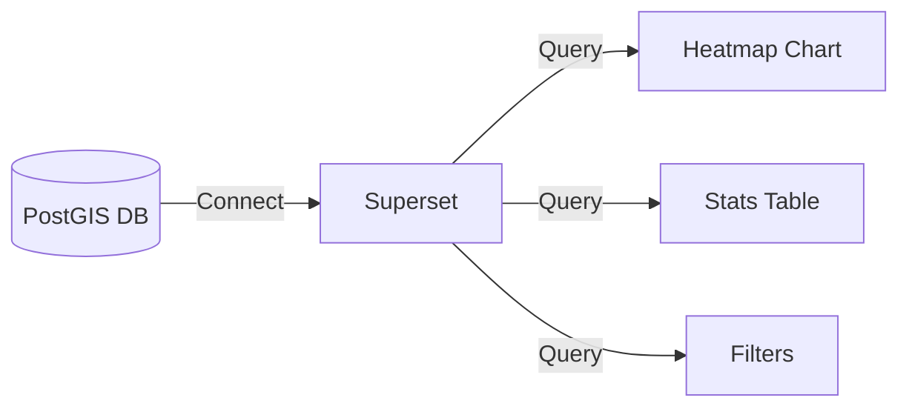

# JFinder Architecture (Low-Code Pivot)

## Overview
This system uses a **No-Code / Low-Code** approach to minimize maintenance and allow rapid iteration.
Core logic is handled by **n8n** workflows instead of custom code.

## Stack
- **Dashboard**: Apache Superset (Port 8088)
- **Orchestration**: n8n (Port 5678)
- **Database**: PostgreSQL 15 + PostGIS (Port 5432)
- **Cache**: Redis

## Data Flow

### 1. Data Ingestion (ETL)
```mermaid
graph LR
    A[Raw Dataset (JSON)] -->|n8n Workflow| B(Parse & Clean)
    B -->|Insert| C[(PostGIS DB)]
    C -->|Auto-Calculate| D(SQL Views)
```
- **n8n** reads the raw JSON file (`app/data/listings.json`).
- Inserts data into `listings` table.
- PostGIS automatically indexes location data.
- SQL Views (`view_district_stats`) auto-update.

### 2. Analytics (Superset)

- **Superset** connects directly to Postgres.
- Users build charts using the "Explore" UI (Drag & Drop).
- No SQL writing required for end-users.

### 3. API Access (Optional Frontend)
If a custom UI is needed:
- Frontend calls **n8n Webhook** (`GET /webhook/search`).
- n8n executes SQL query and returns JSON.
- No Node.js backend server required.

## Directory Structure
- `/db`: Database initialization scripts (`init_db.sql`).
- `/n8n`: Workflow templates for import/automation.
- `/app/data`: Place for raw datasets.
- `/docker-compose.yml`: Infrastructure definition.
