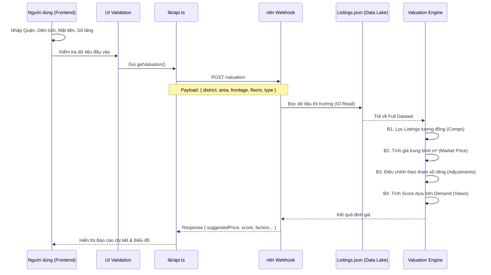

# PHÂN TÍCH CHI TIẾT CHỨC NĂNG ĐỊNH GIÁ AI (AI VALUATION)

**Phiên bản cập nhật: Data-Driven Intelligence**

Tài liệu này phân tích sâu về cơ chế hoạt động, luồng dữ liệu và thuật toán được sử dụng trong chức năng **AI Valuation** của hệ thống Smart Rental DSS sau khi đã được nâng cấp lên mô hình hướng dữ liệu (Data-Driven).

## 1. Tổng Quan
Chức năng AI Valuation không còn sử dụng các luật cứng (hard-coded rules) mà hoạt động như một hệ thống **Comparative Market Analysis (CMA)** thời gian thực. Hệ thống tự động quét kho dữ liệu thị trường để tìm ra các bất động sản tương đồng (Comparables) và đưa ra định giá chính xác dựa trên dữ liệu thực tế.

**Mục tiêu**: Cung cấp mức giá khách quan, có cơ sở dữ liệu chứng minh, giúp người đi thuê tránh bị "hớ" và người cho thuê định giá đúng tài sản.

## 2. Luồng Hoạt Động (Operational Flow)

Mô hình hoạt động theo quy trình khép kín:



## 3. Chi Tiết Thuật Toán (The "Intelligence" Core)

Khác với phiên bản cũ dùng `if-else` ngẫu nhiên, phiên bản mới áp dụng thuật toán thống kê mô tả:

### Bước 1: Tìm kiếm tài sản tương đồng (Comparables Selection)
Hệ thống tìm kiếm trong `listings.json` các tài sản thỏa mãn:
- Cùng **Quận** (`district`).
- Cùng **Loại hình** (`type`).

*Fallback Strategy*: Nếu không tìm đủ dữ liệu (dưới 3 kết quả), hệ thống sẽ mở rộng phạm vi tìm kiếm (chỉ cần cùng Quận) để đảm bảo luôn có kết quả trả về nhưng độ tin cậy thấp hơn.

### Bước 2: Tính toán Giá thị trường (Market Metrics)
Thay vì dùng bảng giá cố định, hệ thống tính toán dynamic:
$$ P_{avg\_m2} = \frac{\sum (Price_i / Area_i)}{N} $$
$$ Frontage_{avg} = \frac{\sum Frontage_i}{N} $$

### Bước 3: Công thức Định giá (Valuation Formula)
Giá gợi ý được tính dựa trên diện tích thực tế nhân với đơn giá trung bình thị trường, sau đó điều chỉnh (Premium/Discount) dựa trên đặc điểm riêng:

$$ P_{suggested} = Area \times P_{avg\_m2} \times (1 + \Delta_{frontage} + \Delta_{floors}) $$

Trong đó:
- **Premium Mặt tiền**: Nếu mặt tiền lớn hơn mặt tiền trung bình của khu vực, giá trị được cộng thêm 5% cho mỗi mét vượt trội.
  `premium_frontage = (frontage - avgFrontage) * 0.05`
- **Premium Số tầng**: Mỗi tầng thêm vào làm tăng giá trị cho thuê thêm 10%.
  `premium_floors = (floors - 1) * 0.10`

### Bước 4: Chấm điểm Tiềm năng (Demand-based Scoring)
Điểm số không còn là random. Nó phản ánh **Nhu cầu thực tế (Market Demand)** thông qua chỉ số Lượt xem (Views):

$$ Score = \min(100, \lfloor \frac{AvgViews}{3000} \times 80 \rfloor + 20) $$

- Khu vực có lượng tìm kiếm (View) cao sẽ có điểm tiềm năng cao.
- Ngưỡng bão hòa là 3000 views (đạt 100 điểm).

## 4. Cấu trúc Dữ liệu Phản hồi

API trả về dữ liệu giàu thông tin hơn để hiển thị trên Dashboard:

```json
{
  "success": true,
  "valuation": {
    "suggestedPrice": 42.5,
    "priceRange": { "min": 38, "max": 47 },
    "potentialScore": 85,
    "riskLevel": "low",
    "factors": [
      {
        "name": "Dữ liệu thị trường",
        "impact": "high",
        "note": "Dựa trên 15 BĐS tương đồng"  <-- Minh bạch nguồn dữ liệu
      },
      {
        "name": "Mặt tiền",
        "impact": "positive",
        "note": "6m (TB khu vực: 4.5m)"        <-- So sánh cụ thể
      }
    ]
  }
}
```

## 5. Giá Trị Business Intelligence (BI Value)

Chức năng này đáp ứng các tiêu chí của một hệ thống hỗ trợ ra quyết định (DSS):
1.  **Data-Driven**: Quyết định dựa trên dữ liệu lịch sử thay vì cảm tính.
2.  **Transpacency**: Giải thích được TẠI SAO lại có mức giá đó (thông qua phần `factors`).
3.  **Real-time**: Khi dữ liệu thị trường biến động (file json cập nhật), giá gợi ý sẽ tự động thay đổi theo.
